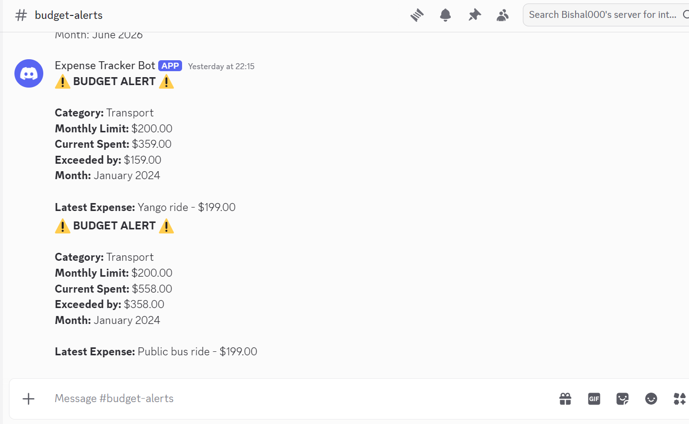

# Expense Tracker API — Intern Screening

A Django REST Framework backend for tracking personal expenses, categories, summaries, authentication, currency conversion, budget alerts, and reporting.

## Repository

GitHub Repository:

https://github.com/Biswaa000/Expense-Tracker-API-Intern-Screening

---

# Setup

## Clone Repository

```bash
git clone https://github.com/Biswaa000/Expense-Tracker-API-Intern-Screening.git
cd Expense-Tracker-API-Intern-Screening
```

## Install Dependencies

```bash
uv sync
```

## Environment Variables

Create a `.env` file:

```env
SECRET_KEY=your-secret-key

BASE_CURRENCY=USD

EXCHANGE_RATE_API_KEY=your-api-key

DISCORD_WEBHOOK_URL=your-discord-webhook-url
```

## Run Migrations

```bash
uv run python manage.py migrate
```

## Start Server

```bash
uv run python manage.py runserver
```

Server:

```text
http://127.0.0.1:8000/
```

---

# Authentication

Authentication is implemented using Django REST Framework Token Authentication.

Protected endpoints require:

```http
Authorization: Token <token>
```

---

# API Endpoints

## Authentication

### Register

```http
POST /api/register/
```

### Login

```http
POST /api/login/
```

## Categories

### Create Category

```http
POST /api/categories/
```

### List Categories

```http
GET /api/categories/
```

## Expenses

### Create Expense

```http
POST /api/expenses/
```

Example:

```json
{
  "title": "Weekly shop",
  "amount": "54.20",
  "currency": "USD",
  "category": 1,
  "date": "2026-06-09",
  "notes": "Supermarket run"
}
```

### List Expenses

```http
GET /api/expenses/
```

### Expense Detail

```http
GET /api/expenses/<id>/
PUT /api/expenses/<id>/
DELETE /api/expenses/<id>/
```

## Reporting

### Category Summary

```http
GET /api/expenses/summary/
```

### Monthly Summary

```http
GET /api/expenses/monthly-summary/
```

### Expense Search

```http
GET /api/expenses/?search=<keyword>
```

---

# My Features

## 1. Authentication

### Overview

Implemented token-based authentication using Django REST Framework Token Authentication. Each user can only access their own categories and expenses.

### Design Decisions

- Used DRF Token Authentication for simplicity.
- Added ownership fields to models.
- Scoped all queries to the authenticated user.
- Protected all expense and category endpoints.

### API Changes

Added:

```http
POST /api/register/
POST /api/login/
```

Protected:

```http
/ api/categories/
/ api/expenses/
/ api/expenses/summary/
/ api/expenses/monthly-summary/
```

### Example Request

```http
POST /api/register/
```

```json
{
  "username": "testuser",
  "password": "testpass123",
  "email": "testuser@example.com"
}
```

### Example Response

```json
{
  "token": "<token>"
}
```

### Assumptions

- Token authentication is sufficient for this project.
- Each user manages only their own expenses and categories.

### Known Limitations

- No token expiration.
- No password reset functionality.

### Commit

```text
15f306d
```

---

## 2. Currency Conversion

### Overview

Expenses can be recorded in different currencies and reported in a single base currency.

### Design Decisions

- Added a `currency` field to expenses.
- Extracted conversion logic into a dedicated service layer.
- Reused conversion service across summary endpoints.
- Base currency configured through environment settings.

### API Changes

Expense payload now includes:

```json
{
  "currency": "USD"
}
```

### Example Request

```http
POST /api/expenses/
```

```json
{
  "title": "Hotel in Paris",
  "amount": "120.00",
  "currency": "EUR",
  "category": 1,
  "date": "2026-06-09",
  "notes": "Two nights"
}
```

### Example Response

```json
{
  "id": 6,
  "title": "Hotel in Paris",
  "amount": "120.00",
  "currency": "EUR",
  "category": 1,
  "date": "2026-06-09",
  "notes": "Two nights"
}
```

### Currency Summary Example

```http
GET /api/expenses/summary/
```

```json
{
  "base_currency": "USD",
  "categories": [
    {
      "category": "Groceries",
      "total": "198.88",
      "rate": "1.1573",
      "as_of": "2026-06-12"
    },
    {
      "category": "Transport",
      "total": "360.31",
      "rate": "0.0066",
      "as_of": "2026-06-12"
    }
  ]
}
```

### Assumptions

- Exchange rates are retrieved from a third-party API.
- Latest exchange rates are acceptable.

### Known Limitations

- External API availability affects conversion.
- Historical exchange rates are not used.

### Commits

```text
9b172c7
5a3a862
```

---

## 3. Budget Alert Bot (Discord)

### Overview

Implemented automated Discord notifications when spending exceeds a category's monthly budget limit.

> **Note:** Discord was used instead of Telegram because I do not currently have a Telegram account. The assignment explicitly allows Discord/Slack as alternatives.

### Design Decisions

- Used Discord Webhooks instead of Telegram.
- Isolated notification logic in a dedicated service layer.
- Triggered alerts on expense creation and updates.
- Kept business logic outside views.

### API Changes

Categories now support:

```json
{
  "monthly_limit": "200.00"
}
```

### Example Request

```json
{
  "name": "Dining",
  "description": "Restaurants and takeout",
  "monthly_limit": "200.00"
}
```

### Example Alert

```text
🚨 Budget Alert

Category: Food
Limit: 200
Current Total: 250

Monthly budget exceeded.
```

### Assumptions

- A Discord webhook URL is configured.
- Budget limits apply monthly.

### Known Limitations

- Alerts are sent immediately.
- Multiple updates may generate repeated alerts.

### Alert Screenshots

Add screenshots here:





### Commit

```text
3ac3b81
```

---

## 4. Expense Search (Optional Feature)

### Overview

Allows users to search expenses using keywords.

### Design Decisions

- Implemented through query parameters.
- Uses case-insensitive matching.
- Supports searching across title and notes.
- Can be combined with date filters.

### API Changes

```http
GET /api/expenses/?search=paris
```

### Example Response

```json
[
  {
    "id": 6,
    "title": "Hotel in Paris",
    "amount": "120.00",
    "currency": "EUR",
    "category": 1,
    "date": "2026-06-09",
    "notes": "Two nights"
  }
]
```

### Assumptions

- Search is performed on title and notes fields.

### Known Limitations

- Full-text search is not implemented.

### Commits

```text
4a3000c
bebeb15
```

---

## 5. Monthly Summary (Optional Feature)

### Overview

Provides monthly spending totals grouped by month.

### Design Decisions

- Aggregates expenses by month.
- Converts all expenses into the configured base currency before aggregation.
- Reuses the existing currency conversion service.

### API Changes

```http
GET /api/expenses/monthly-summary/
```

### Example Response

```json
[
  {
    "month": "2024-01",
    "total": "558"
  },
  {
    "month": "2026-05",
    "total": "50"
  },
  {
    "month": "2026-06",
    "total": "180"
  }
]
```

### Assumptions

- Monthly grouping is based on expense date.

### Known Limitations

- Historical exchange rates are not applied.

### Commit

```text
54a7bd5
```

---

# Bugs Found and Fixed

## Bug 1 — Incorrect Category Field Name in ExpenseSerializer

### Description

Expense creation and serialization failed because the serializer referenced an incorrectly spelled category field.

### Root Cause

A typo in `ExpenseSerializer` referenced a non-existent field.

### Fix

Corrected the category field spelling.

### Commit

```text
b915df8
```

---

## Bug 2 — Incorrect Serializer Reference in Expense Views

### Description

Expense endpoints failed validation because of an incorrect serializer field reference.

### Root Cause

A spelling mistake in expense view logic.

### Fix

Updated serializer references to match the serializer definition.

### Commit

```text
5a0eb30
```

---

## Bug 3 — End Date Filter Was Not Inclusive

### Description

Expenses occurring on the exact end date were excluded from filtered results.

### Root Cause

A strict comparison operator was used instead of an inclusive comparison.

### Fix

Replaced the date comparison with an inclusive filter.

### Commit

```text
6b628b1
```

---

## Bug 4 — Missing Aggregation Import

### Description

The summary endpoint failed when calculating totals.

### Root Cause

`Sum` was used without importing it from Django ORM.

### Fix

Added:

```python
from django.db.models import Sum
```

### Commit

```text
983af83
```

---

## Bug 5 — URL Routing Conflict

### Description

Specific routes such as:

```http
/api/expenses/summary/
```

were incorrectly matched as expense IDs.

### Root Cause

The generic route:

```python
path("expenses/<pk>/", ...)
```

was declared before specific routes.

### Fix

Reordered URL patterns so specific routes are matched first.

### Commit

```text
7de2896
```

---

# Postman Collection

The repository includes an updated Postman collection covering:

- Authentication (Register/Login)
- Categories
- Expense CRUD operations
- Date filtering
- Currency conversion
- Expense summary
- Budget alert workflow
- Expense search
- Monthly summary

---

# Submission Checklist

- [x] Fixed all required bugs
- [x] Authentication implemented
- [x] Currency conversion implemented
- [x] Budget alert bot implemented
- [x] Expense search implemented
- [x] Monthly summary implemented
- [x] Updated Postman collection
- [x] Updated README
- [x] Added Discord alert screenshots

---

# Author

**Bishal Sharma**

GitHub: https://github.com/Biswaa000

